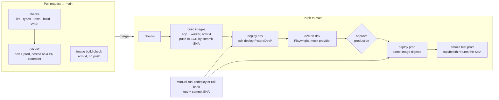

# Pictora CI/CD Design

Oct 8, 2026 · Rakesh Pillai · Status: Draft v0.1 · Companion to the [tech design](tech_design.md)

Every pull request is checked automatically. Every merge to `main` builds once, deploys to dev, runs end-to-end tests, then waits for your approval to promote **the same images** to prod. GitHub Actions authenticates to AWS with OIDC, so no AWS keys are stored anywhere.

## 1. Goals

1. No untested code reaches `main`: lint, type checks, unit and infra tests on every PR.
2. Build once, promote the same artifact: prod runs the exact container digests that passed in dev.
3. A human gate before prod, with a one-click rollback to any earlier commit.
4. No long-lived credentials: OIDC to AWS; provider API keys stay in AWS Secrets Manager.
5. Fast feedback: PR checks in under 8 minutes, merge to dev in under 20 minutes.
6. Safe for a public repo: forks can't reach AWS or secrets.

## 2. Context

| Fact | Effect on the design |
| --- | --- |
| The repo `rakeshsasidharan/pictora` is **public** | Free GitHub-hosted runners, including arm64 (`ubuntu-24.04-arm`); environments with required reviewers are available; fork PRs need guarding; never commit account IDs, domains in config, or secrets |
| The GitHub OIDC provider already exists in the AWS account | Reuse it; only new IAM roles are needed |
| CDK is bootstrapped in us-west-2 and us-east-1 | CI assumes the standard `cdk-hnb659fds-*` bootstrap roles |
| dev and prod are in one AWS account | Simpler, but a dev deploy role could in theory change prod stacks (see section 8) |
| Branch-per-issue workflow (`<issue>-<slug>`), PRs created and merged by you | PR checks are the main quality gate; `main` is always deployable |
| `.github/workflows/app.yml` was copied from Hermes | It points at Hermes resources and an `app/` folder that doesn't exist yet. **Delete it** when these workflows land |

## 3. Pipeline overview



## 4. Workflows

| File | Trigger | Jobs | Purpose |
| --- | --- | --- | --- |
| `.github/workflows/checks.yml` | `workflow_call` (reusable) | `checks` | One definition of lint, typecheck, tests, build and synth, used by both pipelines |
| `.github/workflows/pr.yml` | `pull_request` → `main` | `changes`, `checks`, `image-check`, `cdk-diff` | PR gate |
| `.github/workflows/deploy.yml` | `push` → `main`; `workflow_dispatch` (environment, commit SHA) | `checks`, `build-images`, `deploy-dev`, `e2e-dev`, `deploy-prod`, `smoke-prod` | Build once, deploy dev, promote to prod; also used for redeploys and rollbacks |
| `.github/dependabot.yml` | Weekly | — | npm (grouped minor and patch), GitHub Actions, Docker base images |

Docs-only changes (`docs/**`, `**/*.md`) skip `deploy.yml` through `paths-ignore`. On PRs, the `changes` job uses `dorny/paths-filter` to skip the image check when only docs or infra changed.

### 4.1 `checks` (reusable)

Runs on `ubuntu-24.04-arm` with Node 22 and the npm cache.

1. `npm ci` (one root lockfile; npm workspaces).
2. `npm run lint` (ESLint across workspaces) and `npm run format:check` (Prettier).
3. `npm run typecheck` (`tsc --noEmit` per workspace).
4. `npm test`, which runs Vitest in every workspace. DynamoDB Local runs as a job service container (`amazon/dynamodb-local`) for the API and worker tests.
5. `npm run build -w app` (Next.js build; catches build-only errors).
6. `npx cdk synth --all` with dummy image digests and `npm test -w infra` (CDK assertions).
7. `npm audit --omit=dev --audit-level=high`, which fails the build on high or critical issues in runtime dependencies.

Target: under 6 minutes.

### 4.2 `pr.yml`

| Job | Runs when | Details |
| --- | --- | --- |
| `changes` | Always | Outputs `app`, `worker`, `packages`, `infra` flags |
| `checks` | Always | Calls `checks.yml` |
| `image-check` | app, worker or packages changed | `docker buildx build` of both images on arm64, no push. Catches Dockerfile breaks before merge |
| `cdk-diff` | infra or packages changed, **and the PR is from this repo, not a fork** | OIDC → `pictora-gh-diff` role → `cdk diff 'PictoraDev/*' 'PictoraProd/*'`. Posts or updates one PR comment headed `## CDK Diff` |

Guard for fork PRs: `if: github.event.pull_request.head.repo.full_name == github.repository`. Never use `pull_request_target`.

### 4.3 `deploy.yml`

```yaml
name: Deploy
on:
  push:
    branches: [main]
    paths-ignore: ['docs/**', '**/*.md']
  workflow_dispatch:
    inputs:
      environment: { type: choice, options: [dev, production], required: true }
      sha: { description: 'Commit SHA to deploy (already built)', required: true }

concurrency:
  group: deploy-${{ github.event_name == 'workflow_dispatch' && inputs.environment || 'pipeline' }}
  cancel-in-progress: false

permissions:
  contents: read
  id-token: write

jobs:
  checks:            # push only
  build-images:      # push only; matrix [app, worker]; runs-on ubuntu-24.04-arm
                     # OIDC → pictora-gh-build → ECR login → buildx --platform linux/arm64
                     # tags <sha>; outputs app_digest, worker_digest
  deploy-dev:        # environment: dev; needs build-images
                     # OIDC → pictora-gh-deploy → cdk deploy 'PictoraDev/*'
                     #   -c appImageDigest=… -c workerImageDigest=… -c gitSha=…
  e2e-dev:           # environment: dev; Playwright against the dev URL
  deploy-prod:       # environment: production (required reviewer); needs e2e-dev
                     # same digests from build-images outputs
  smoke-prod:        # curl https://<prod>/api/health and check that sha == github.sha
```

**Details**

- **Images:** two ECR repositories, `pictora-app` and `pictora-worker`, with **immutable tags** and scan on push. Tag = full commit SHA. CDK references images **by digest** (`DockerImageCode.fromEcr(repo, { tagOrDigest: digest })`), so a deploy is reproducible.
- **Build cache:** `docker/build-push-action` with `cache-from/cache-to: type=gha,scope=<image>`, which keeps rebuilds to about 1–2 minutes.
- **CDK:** stages `PictoraDev` and `PictoraProd`. Deploy command: `npx cdk deploy '<Stage>/*' --require-approval never --concurrency 3 --outputs-file cdk-outputs.json`. The outputs file gives `e2e-dev` the site URL.
- **Promotion:** `deploy-prod` uses `needs.build-images.outputs`. Nothing is rebuilt, so prod runs exactly what passed e2e in dev.
- **Approval:** the `production` environment has you as the required reviewer. The run pauses with a "Review deployments" button. Prod waits until you approve, and an unapproved run expires after 30 days.
- **Version check:** CDK passes `GIT_SHA` to the app Lambda. `/api/health` returns `{ status: 'ok', sha }`, and the smoke test checks it.
- **Run time:** checks 6 min + build 3 min + dev deploy 5 min + e2e 4 min ≈ **18 minutes to dev**; prod adds about 6 minutes after approval.

### 4.4 Redeploy and rollback

Run **Deploy → Run workflow**, pick `environment` and `sha`.

1. The `resolve` job checks that both images exist in ECR with that tag (`aws ecr describe-images`) and reads their digests. If they're missing, it fails with a message to build that commit first.
2. It checks out **that SHA**, so infrastructure rolls back too, then deploys only the chosen environment.
3. It runs the smoke test (prod) or e2e (dev).

**Rules that keep rollback safe**

- DynamoDB changes must be additive: new attributes or entities only, and readers must handle missing fields. Never rename or reuse a key format within one release.
- Never remove a resource and the code using it in the same release; remove the code first, then the resource in a later release.
- The model registry seed keeps `enabled` flags already in DynamoDB, so a rollback doesn't re-enable a model you switched off.
- Stateful prod resources (table, images bucket, user pool) have `RemovalPolicy.RETAIN`.

## 5. Environments and configuration

### 5.1 GitHub environments

| Environment | Protection | Deployment branches | Variables | Secrets |
| --- | --- | --- | --- | --- |
| `dev` | None | `main` only | `SITE_URL` (`https://pictora.rpillai.dev`) | `E2E_USER_PASSWORD` (Cognito test user) |
| `production` | Required reviewer: `rakeshsasidharan` (self-review allowed) | `main` only | `SITE_URL` | None |

Repository variables (not secrets; kept out of code so the public repo holds no account details): `AWS_ACCOUNT_ID`, `AWS_REGION` (`us-west-2`), `AWS_BUILD_ROLE_ARN`, `AWS_DEPLOY_ROLE_ARN`, `AWS_DIFF_ROLE_ARN`, `E2E_USER_EMAIL`.

Per-environment app settings (daily points, spend cap, queue concurrency, domain) live in CDK context in `infra/cdk.json`. A domain name is public anyway, so it can live there once chosen.

### 5.2 What lives where

| Item | Location | Who sets it |
| --- | --- | --- |
| OpenAI and Gemini keys | AWS Secrets Manager `pictora/<env>/…` | You, once per environment, via console or CLI |
| AWS access for CI | OIDC roles; ARNs in repository variables | `PictoraCicd` stack |
| e2e test user password | `dev` environment secret | You |
| Image digests | Job outputs (pipeline) or ECR lookup (rollback) | Pipeline |

## 6. AWS IAM for CI (the `PictoraCicd` stack)

A small CDK stack, `PictoraCicd`, holds everything CI needs. **You deploy it once from your laptop** (`npx cdk deploy PictoraCicd`); after that, CI never changes it. It imports the existing GitHub OIDC provider by ARN.

| Role | Trusted when the token `sub` is | Can do |
| --- | --- | --- |
| `pictora-gh-diff` | `repo:rakeshsasidharan/pictora:pull_request` | Assume the CDK bootstrap **lookup** role (read-only), for `cdk diff` |
| `pictora-gh-build` | `repo:rakeshsasidharan/pictora:ref:refs/heads/main` | Push and read on `pictora-app` and `pictora-worker` ECR repos only |
| `pictora-gh-deploy` | `repo:rakeshsasidharan/pictora:environment:dev` or `…:environment:production` | Assume the CDK bootstrap deploy, file-publishing, image-publishing and lookup roles in us-west-2 and us-east-1; read ECR images |

All roles require `aud = sts.amazonaws.com`, a 1-hour maximum session, and no inline admin rights. The deploy role is trusted **only from GitHub environments**, and environments accept only `main`, so a feature branch can never deploy.

The stack also creates the two ECR repositories: immutable tags, scan on push, and a lifecycle rule keeping the newest 50 images. That's enough for rollbacks across several weeks of merges.

## 7. Repository settings

| Setting | Value |
| --- | --- |
| Ruleset on `main` | Require a pull request (0 approvals; you are the only maintainer); require status checks `checks` and `image-check`; block force pushes and deletion |
| Actions → Fork PR workflows | Require approval for all outside contributors |
| Actions → Workflow permissions | Read-only `GITHUB_TOKEN` by default; workflows ask for more per job |
| Secret scanning + push protection | On (free for public repos) |
| CodeQL | Default setup on, for JavaScript/TypeScript (free for public repos) |
| Dependabot alerts + security updates | On |
| Action pinning | Major versions (`@v4`), kept current by Dependabot; third-party actions (`dorny/paths-filter`) pinned to a commit SHA |

## 8. Risks and trade-offs

| Risk | Mitigation now | Later option |
| --- | --- | --- |
| dev and prod in one account: CDK deploy roles can change any stack | Deploy role trusted only from protected environments on `main`; prod stacks retain stateful data; PITR and S3 versioning in prod | Move prod to its own AWS account in your organisation; bootstrap with a trust policy for the CI account |
| CDK bootstrap execution role is broad (default admin) | Accepted for a solo project; all changes go through PR review and `cdk diff` | Bootstrap with a custom, narrower `--cloudformation-execution-policies` |
| Fork PRs in a public repo | No OIDC or secrets for forks; no `pull_request_target`; approval required for outside contributors' runs | — |
| e2e depends on a live dev stack | Mock provider (no spend); 2 retries in Playwright for flaky network steps; failures block prod | Add a preview environment per PR if needed |
| A failed prod deploy leaves the app half-updated | CloudFormation rolls back the failed stack automatically; rerun with the previous SHA | Lambda aliases with CodeDeploy canary (10% for 5 minutes) on the app and worker |

## 9. Setup order

These steps fit M0 (Oct 9–10). Each becomes a GitHub issue with tests where they apply.

1. Create the npm workspaces skeleton with `lint`, `typecheck`, `test` and `build` scripts.
2. Write the `PictoraCicd` stack and deploy it from your laptop; copy the role ARNs into repository variables.
3. Create the `dev` and `production` GitHub environments (section 5.1).
4. Add `checks.yml` and `pr.yml`, and delete the Hermes `app.yml`.
5. Add `deploy.yml` with dev only; once dev deploys work, add `e2e-dev`, `deploy-prod` and `smoke-prod`.
6. Turn on the `main` ruleset, secret scanning, CodeQL and Dependabot (section 7).
7. Store provider keys in Secrets Manager for both environments.
8. Do a dry-run rollback in dev to prove the manual path.
