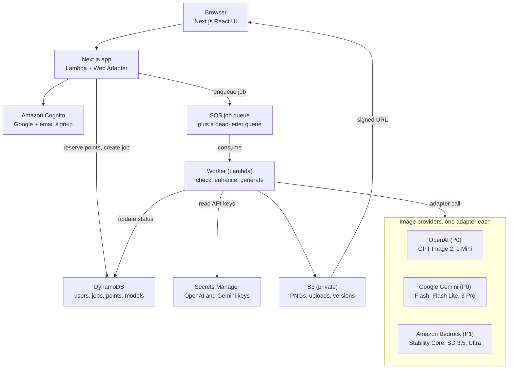

# Pictora PRD

Oct 7, 2026 · Rakesh Pillai

## Overview

Pictora is a free web app where anyone types a prompt and gets a high-quality PNG, from painterly art to photorealism, then edits it in words and keeps it in a private gallery. v1 launches with OpenAI and Google Gemini image models; Amazon Bedrock (Stability AI) follows in P1 as a lower-cost tier.

**Problem.** The best image models sit behind separate developer APIs, each with its own sign-up, pricing and quirks. Consumer apps tend to lock users into one model and one look. Casual users can't write the detailed prompts these models reward.

**Product.** One simple app that picks the right model for each style, rewrites rough prompts into strong ones, and lets users refine results conversationally. A provider-neutral backend lets us add, swap or retire models from config as the market moves.

**Status.** Draft v0.1. Built with Next.js, hosted entirely on AWS.

## Goals and success metrics

v1 succeeds if new users get a result they keep on the first try, and it costs no more than the budget we set per user.

**Goals**

1. A first image a user is happy with, in under a minute from landing.
2. Results that range from artistic to photorealistic, chosen by style rather than by model name.
3. Edits made in plain words, without masks or design tools.
4. Provider-neutral architecture: a new model is added through config plus one adapter, with no UI rewrite.
5. Cost per user that is predictable and capped.

**Non-goals for v1**

- Payments, subscriptions or credits (free only for now).
- Public sharing, feeds or social features (images stay private).
- Video, animation, 3D or vector output.
- Training or fine-tuning custom models.
- Native mobile apps (the web app must still work on phones).
- Team workspaces or an API for third parties.

**Success metrics** (targets to confirm after the beta)

| Metric | Definition | v1 target |
| --- | --- | --- |
| Activation | New sign-ups who generate 1+ image in their first session | 70% |
| Keep rate | Images downloaded or kept in the gallery ÷ images generated | 35% |
| Time to first image | Landing to first image shown (p50) | < 60 s |
| Generation success | Jobs finished without error or timeout | ≥ 98% |
| Week-1 retention | Users who return and generate within 7 days | 25% |
| Cost per active user | Provider spend ÷ weekly active users | ≤ daily budget × 7 |
| Moderation false blocks | Blocked prompts overturned on review | < 2% |

## Target users

v1 serves consumers making images for personal use, who know nothing about models and judge only by the result.

| Persona | Who | What they want | Implication for v1 |
| --- | --- | --- | --- |
| Casual creator | Makes images for fun: wallpapers, gifts, memes, pets as art | Quick, pretty results from a short prompt | Style presets, prompt enhancer on by default, sensible defaults |
| Hobbyist artist | Explores styles and ideas, iterates a lot | Control over style, aspect ratio and quality; reruns and variations | Advanced panel (model, quality, seed), history to revisit settings |
| Personal-project maker | Needs visuals for a blog, invitation, school project or small side business | Readable text in images, specific sizes, clean PNGs | Text-capable models, size presets, transparent background (OpenAI) |

**Core use cases**

1. Type an idea, pick a style, get 1 to 4 options, download a PNG.
2. Refine a result by asking for changes ("make it night", "remove the car").
3. Upload a personal photo and change it ("turn this into a watercolour").
4. Come back later, find past images and rerun them with the same settings.

## Scope and priorities

P0 ships OpenAI and Gemini with four features: generate, edit with prompt, prompt enhancer and gallery. P1 adds Bedrock (Stability AI) as a cheaper tier, plus its upscale and editing tools.

| Priority | Area | In scope |
| --- | --- | --- |
| P0 | Providers | OpenAI Images API and Gemini API behind one provider interface |
| P0 | Sign-in | Amazon Cognito with Google sign-in and email |
| P0 | Generate from prompt | Model picker, style presets, aspect ratio, quality, 1 to 4 images, PNG download |
| P0 | Edit with prompt | Change a generated or uploaded image in words; multi-turn refinement |
| P0 | Prompt enhancer | LLM rewrites the prompt before generating; user can view, edit or turn it off |
| P0 | Gallery / history | Private per-user gallery, image details, rerun with the same settings, delete |
| P0 | Free daily budget | Cost-based daily allowance per user, shown as images left |
| P0 | Moderation | Prompt screening plus provider filters, with blocks logged |
| P0 | Admin basics | Model registry config, spend dashboard, global kill switch per model |
| P1 | Bedrock provider | Stable Image Core, SD 3.5 Large and Stable Image Ultra as low-cost options |
| P1 | Image tools | Upscale, remove background, erase object, outpaint (Stability on Bedrock) |
| P1 | Smart routing | Auto mode picks a model from style and budget |
| P1 | Batch mode | Slower, half-price generation through provider batch APIs |
| Later | Monetisation | Credits or subscription for premium models and higher limits |
| Later | Sharing | Share links, then an opt-in public gallery |
| Later | Collections | Folders, tags and search across the gallery |

## Functional requirements

Each requirement has an ID for tickets and test cases; all are P0 unless marked.

**Accounts (AUTH)**

- AUTH-1: Sign up and sign in with Google, or with email and password plus email verification, through Amazon Cognito.
- AUTH-2: Generating, editing and the gallery require sign-in. The landing page shows sample images to signed-out visitors.
- AUTH-3: Users can delete their account, which removes all images and data within 30 days.
- AUTH-4: Users must be 13 or older and accept the terms of service and content policy at sign-up.

**Generate (GEN)**

- GEN-1: Prompt box of up to 2,000 characters, with an optional "avoid" field that is passed as a negative prompt where the model supports one.
- GEN-2: Style presets: Photorealistic, Cinematic, Digital art, Anime, Watercolour, Oil painting, 3D render, Line art and None. A preset adds tested style text to the prompt and may suggest a model.
- GEN-3: Aspect ratios 1:1, 4:5, 3:2, 2:3, 16:9 and 9:16, mapped to each model's nearest supported size.
- GEN-4: Quality options Draft, Standard and High, mapped to provider settings and shown with their cost in the user's allowance.
- GEN-5: The model picker shows friendly names, strengths and cost per image. The default is chosen by the style preset.
- GEN-6: 1 to 4 images per request; every image is counted against the allowance.
- GEN-7: Results come back as PNG at the model's native resolution. Download keeps the original PNG with no recompression.
- GEN-8: Jobs run in the background. The UI shows queued, generating and done states, and the user can leave the page and find results in the gallery.
- GEN-9: Optional transparent background on models that support it (OpenAI P0), hidden on others.
- GEN-10: Failures show a plain-language reason (blocked, timeout, provider error) and refund the allowance.

**Edit with prompt (EDIT)**

- EDIT-1: "Edit" on any gallery image opens a chat-style panel: the user describes a change and gets a new version.
- EDIT-2: Users can upload a JPEG, PNG or WebP of up to 10 MB as the starting image. It is screened by moderation before use.
- EDIT-3: Each edit creates a new version linked to its parent. The user can step back through versions, and originals are never overwritten.
- EDIT-4: Edits use Gemini image models (conversational editing) or the OpenAI image edit endpoint; P1 adds Stability tools.
- EDIT-5: Optional reference images (up to 3) for style or subject, where the model supports them.

**Prompt enhancer (ENH)**

- ENH-1: On by default. A low-cost LLM rewrites the prompt with subject, composition, lighting and style detail suited to the chosen model.
- ENH-2: The enhanced prompt is shown and can be edited before or after generating. Toggling it off sends the user's words unchanged.
- ENH-3: The enhancer must keep the user's intent and must not add people, brands or content the user did not ask for.
- ENH-4: The enhancer's input and output both pass moderation.

**Gallery (GAL)**

- GAL-1: Private grid of the user's images, newest first, with infinite scroll.
- GAL-2: The detail view shows the prompt, enhanced prompt, model, style, size, seed (where available), date and version history.
- GAL-3: Actions: download PNG, rerun with the same settings, edit, delete.
- GAL-4: Images are served only through short-lived signed URLs; no image is public.

**Limits (LIM)**

- LIM-1: Each user gets a daily budget in cost units that resets at 00:00 UTC; see Cost control.
- LIM-2: Before generating, the UI shows the cost of the request and what remains ("uses 3 of your 25 points today").
- LIM-3: Per-user rate limit of 10 jobs a minute and 2 running at once.

**Admin (ADM)**

- ADM-1: Models are defined in a registry (DynamoDB or config file): enabled, provider, model ID, parameters, cost and default flags.
- ADM-2: A kill switch per model and per provider; disabled models disappear from the UI within 1 minute.
- ADM-3: A dashboard of spend by day, model and provider; top users by spend; moderation block counts.
- ADM-4: Admins can suspend a user and review flagged prompts.
- ADM-5: Admins can override a user's daily point allowance with an optional `dailyPoints` attribute on the user's DynamoDB record, edited in the AWS console or CLI; no admin UI in v1. The new value applies from the next request, and removing it restores the 25-point default.

## Model catalogue

P0 launches with five image models across OpenAI and Gemini, costing about $0.005 to $0.24 an image. Bedrock adds three cheaper Stability models in P1. Prices are approximate list prices for a ~1K image as of October 2026, and model IDs must be checked against provider docs at build time.

| Priority | Provider | Model (ID) | Strengths | Approx. cost / image | Role in Pictora |
| --- | --- | --- | --- | --- | --- |
| P0 | OpenAI | [GPT Image 2](https://developers.openai.com/api/docs/guides/image-generation) (`gpt-image-2`) | Prompt adherence, text in images, transparent PNG, edits | $0.006 low · $0.053 medium · $0.21 high (1024²) | Default for text-heavy and Standard or High quality |
| P0 | OpenAI | GPT Image 1 Mini (`gpt-image-1-mini`) | Very cheap drafts | ~$0.005 | Draft quality and previews |
| P0 | Google | [Gemini 3.1 Flash Image](https://ai.google.dev/gemini-api/docs/pricing) (`gemini-3.1-flash-image`) | Fast, conversational editing, character consistency, up to 4K | $0.067 at 1K · $0.101 at 2K | Default for editing and artistic styles |
| P0 | Google | Gemini 3.1 Flash Lite Image (`gemini-3.1-flash-lite-image`) | Cheapest Gemini option | ~$0.034 at 1K | Budget generation |
| P0 | Google | Gemini 3 Pro Image (`gemini-3-pro-image`) | Highest-fidelity Gemini, complex scenes | $0.134 at 1–2K · $0.24 at 4K | High quality, photorealism |
| P1 | Bedrock | Stable Image Core (`stability.stable-image-core-v1:1`) | Fast, low cost | $0.04 | Budget tier |
| P1 | Bedrock | SD 3.5 Large (`stability.sd3-5-large-v1:0`) | Balanced, broad styles, negative prompts | $0.08 | Mid tier |
| P1 | Bedrock | Stable Image Ultra (`stability.stable-image-ultra-v1:1`) | Photorealistic detail | $0.14 | Premium photoreal |
| Watch | OpenAI | GPT Image 2.5 Flare / Sunburst | Newest; adds xhigh and max quality | Not published | Evaluate when priced |

**Supporting models**

- Prompt enhancer: a low-cost text LLM. Candidates are GPT-5.6 Luna on Bedrock (IAM auth, no extra key) or Gemini Flash, to be chosen by a quality and latency test.
- Moderation: the OpenAI moderation endpoint for prompts and uploaded images, with gpt-oss-safeguard on Bedrock as an option for a custom policy.

**Registry rules**

- Every model is a registry entry: `id`, `provider`, `providerModelId`, `capabilities` (generate, edit, transparent, negativePrompt, maxResolution, aspectRatios), `costUnits` per quality, `enabled`, `defaultFor` (styles).
- The UI reads the registry; it never hard-codes a model.
- Bedrock limits for P1: generation models are on demand in us-west-2 only; edit tools use the `us.` cross-region profiles.

## Architecture

The Next.js app on AWS only accepts and tracks jobs. A queue-driven worker does the slow work: moderation, prompt enhancement, the provider call and storage.

**Request lifecycle**

1. The browser posts a generate or edit request to a Next.js API route, with the Cognito session.
2. The API checks rate limits, reserves points in DynamoDB, writes a `queued` job and sends it to SQS. It returns the job ID in under 1 second.
3. The worker Lambda moderates the prompt, runs the enhancer, calls the provider adapter, and writes PNGs to S3.
4. The job record moves to `done` (or `failed` or `blocked`, with refund). The browser polls the job status (or uses server-sent events) and loads images through short-lived signed URLs.

**Key decisions**

- Hosting: Next.js (standalone output) built as a container image in ECR and run on Lambda with the AWS Lambda Web Adapter, behind CloudFront via a Lambda Function URL; static assets are served from S3 through CloudFront. It scales to zero; the same image can move to ECS Fargate if Lambda limits on time or size become a problem.
- Provider adapter interface: `generate(request)`, `edit(request)` and `capabilities()`, returning a common result (PNG bytes, seed, cost, provider request ID). Each provider is its own module.
- The worker Lambda timeout is set to 3 minutes; SQS visibility timeout is above that; failed messages go to a dead-letter queue with an alarm.
- Images are stored as `s3://<bucket>/users/<userId>/<imageId>/v<n>.png`, with metadata in DynamoDB. The browser loads and downloads them through short-lived S3 presigned URLs (15 minutes); uploads use S3 presigned POST.
- Infrastructure as code with AWS CDK (TypeScript), with separate dev and prod stacks.
- P1 Bedrock calls use the worker's IAM role, with no API keys.

## Cost control and free daily budget

Each user gets 25 points a day, where 1 point is $0.01 of provider cost. That caps one user at $0.25 a day, about $7.50 a month in the worst case.

**How points work**

- Point cost per image = provider list price rounded up to the nearest cent, stored in the registry and updated when prices change.
- Points are reserved when the job is queued, settled on completion, and refunded on failure or a moderation block.
- Points reset at 00:00 UTC and do not roll over.
- The prompt enhancer and moderation calls are not charged to users; their cost is tracked as overhead.
- 25 points is the default. An admin can set a different daily allowance per user by editing that user's `dailyPoints` attribute in the DynamoDB users table; when it is absent, the default applies (ADM-5).

**What 25 points buys** (illustrative, at current prices)

| Model and quality | Points per image | Images a day |
| --- | --- | --- |
| GPT Image 1 Mini, Draft | 1 | 25 |
| Gemini 3.1 Flash Lite Image | 4 | 6 |
| Gemini 3.1 Flash Image, 1K | 7 | 3 |
| GPT Image 2, medium | 6 | 4 |
| Gemini 3 Pro Image, 1–2K | 14 | 1 |
| GPT Image 2, high | 22 | 1 |

**Global safeguards**

- A platform-wide spend cap of $100 a month (set in config), checked before every job. At 80% ($80) the admin is alerted; at 100% premium models are paused and only Draft-quality models stay on.
- AWS Budgets plus OpenAI and Google billing alerts at 50%, 80% and 100% of the $100 monthly cap.
- New accounts start with the same budget; abuse signals (many accounts from one device or IP, disposable email domains) lower it to 5 points.
- Every job records its actual provider cost for reconciliation against provider invoices.

The 25-point figure is a starting value and is set in config, so it can change without a release.

## Trust and safety

Every request passes our own prompt check before any paid call, then the provider's built-in filters; blocks are refunded, logged and explained to the user.

**Moderation flow**

1. The user's prompt (and any uploaded image) goes through the moderation check. If it is flagged, it is blocked before any spend.
2. The prompt enhancer runs, and its output is checked again.
3. The provider generates with its own safety filters on, at default or stricter settings.
4. If the provider refuses, the job ends as blocked, points are refunded, and the user sees a neutral message.
5. Blocks are logged with user, prompt, category and stage, kept for 90 days for review.

**Policy**

- Not allowed: sexual content involving minors (zero tolerance; account terminated), sexual content in general, graphic violence, hate, self-harm, real-person deepfakes in harmful or sexual contexts, and illegal activity.
- Uploaded photos of real people may be edited for harmless personal use only. Edits that sexualise, humiliate or impersonate are blocked.
- 3 blocks in 24 hours cool the account down for 24 hours; repeated serious violations lead to suspension and admin review.
- Users report problem outputs from the image detail view.

**Provenance**

- Keep provider watermarks and C2PA metadata intact; never strip them on download.
- Store model, prompt and timestamp for every image to answer takedown or abuse reports.

Legal review of the terms of service, content policy and privacy policy is a launch blocker.

## Non-functional requirements

| Area | Requirement |
| --- | --- |
| Latency | UI responds in < 200 ms; job accepted in < 1 s; p50 image ready ≤ 20 s, p95 ≤ 60 s (Pro models may take longer); job timeout 120 s |
| Availability | 99.5% monthly for the web app and job API; a single provider outage disables only its models |
| Resilience | One automatic retry on provider 5xx or throttling, with backoff; then the job fails and points are refunded |
| Scale | Up to 50 jobs at once at launch, limited by provider quotas; the queue absorbs bursts |
| Security | Provider API keys in AWS Secrets Manager, never in the browser; IAM roles for AWS services; S3 buckets private, with block public access on and SSE encryption |
| Privacy | Images and prompts belong to the user; no training on user data (provider settings confirmed); deletion within 30 days; data stored in one US AWS region |
| Accessibility | WCAG 2.2 AA; keyboard-friendly; alt text auto-generated for gallery images |
| Responsiveness | Works from 360 px phone width to desktop |
| Observability | Structured logs per job (job ID, user, model, latency, cost, outcome); metrics and alarms on error rate, p95 latency, queue depth and spend |
| Browser support | Last 2 versions of Chrome, Safari, Firefox and Edge |

## Risks and dependencies

The biggest risks are model churn and runaway free-tier cost. Amazon retired two image models in 2026 (Titan Image on June 30, Nova Canvas on September 30), and Google shut down Gemini 2.5 Flash Image on October 2.

| Risk | Impact | Mitigation |
| --- | --- | --- |
| A provider retires or changes a model | Broken feature, emergency migration | Registry plus adapters; track end-of-life dates; a fallback model per style; alert 60 days before end of life |
| Free tier abused or costs spike | Unbounded spend | Daily points, global cap, abuse signals, billing alerts, kill switches |
| OpenAI organisation verification delayed | P0 blocked for OpenAI models | Start verification in week 1; Gemini-only launch as fallback |
| Provider rate limits too low | Slow jobs or failures at launch | Request quota increases early; queue with concurrency limits per provider |
| Harmful or illegal content generated | Legal and reputation damage | Layered moderation, logs, reporting, legal review |
| Provider price changes | Budget maths wrong | Prices in the registry; monthly reconciliation |
| Quality differs between providers for the same style | Inconsistent results | Per-style default models chosen by side-by-side tests |

**Dependencies**

- OpenAI API account with organisation verification and image model access.
- Google AI (Gemini API) or Vertex AI project with billing and quota.
- AWS account: Cognito, S3, SQS, Lambda, DynamoDB, Secrets Manager, CloudFront, and Bedrock model access for P1.
- Google OAuth client for sign-in, plus a custom domain with TLS.
- Legal: terms of service, content policy, privacy policy.

## Milestones and open questions

Public launch is November 6, 2026. The build is one developer working with coding agents, so P0 (M0 to M3) is sized to 3 weeks from October 9 to October 29, which fits within LLM usage limits. A one-week private beta follows, and Bedrock lands as P1 by November 20.

| Milestone | Start | End |
| --- | --- | --- |
| M0 Setup and accounts | Oct 9, 2026 | Oct 10, 2026 |
| M1 Generate (P0) | Oct 11, 2026 | Oct 15, 2026 |
| M2 Edit, enhancer, gallery | Oct 16, 2026 | Oct 22, 2026 |
| M3 Safety, limits, admin | Oct 23, 2026 | Oct 29, 2026 |
| M4 Private beta | Oct 30, 2026 | Nov 5, 2026 |
| **Public launch** | **Nov 6, 2026** | |
| M5 Bedrock + tools (P1) | Nov 7, 2026 | Nov 20, 2026 |

**Exit criteria**

| Milestone | Done when |
| --- | --- |
| M0 Setup and accounts | OpenAI organisation verified; Gemini API billing on; AWS CDK stacks for dev deployed; Cognito sign-in works |
| M1 Generate (P0) | Both providers behind the adapter interface; style presets, sizes and quality work; PNGs in S3; background jobs with status |
| M2 Edit, enhancer, gallery | Multi-turn edits with versions; upload editing; enhancer on by default; gallery with rerun and delete |
| M3 Safety, limits, admin | Moderation flow live; daily points and global cap enforced; admin registry, kill switches and spend dashboard; legal pages approved |
| M4 Private beta | Invited users for one week; success metrics measured; p95 latency and error rate within targets |
| Public launch | Beta issues fixed; alarms and budgets live; on-call runbook written |
| M5 Bedrock + tools (P1) | Stability models in the registry; upscale, remove background, erase and outpaint shipped |

**Open questions**

- [x] Team size and start date, which set the real timeline.
- [x] Daily budget: is 25 points ($0.25) per user right, and what is the platform-wide monthly spend cap?
- [ ] Gemini through the Gemini API (simpler) or Vertex AI (enterprise terms, Google Cloud billing)?
  Leaning toward Vertex AI so Gemini usage bills through Google Cloud; still to be explored before the provider setup work starts.
- [ ] Which prompt enhancer model wins the quality and latency test: GPT-5.6 Luna on Bedrock or Gemini Flash?
- [ ] Exact Gemini and OpenAI model IDs and prices, to verify against provider docs at build time.
- [x] Launch geography: US only, or also EU/UK (affects GDPR, data region and age rules)?
  Decided: US only at launch.
- [x] Brand and domain name: is "Pictora" final?
  Decided: Pictora is the final name.

**Sources** (checked October 7, 2026)

- [OpenAI API pricing](https://developers.openai.com/api/docs/pricing) and [image generation guide](https://developers.openai.com/api/docs/guides/image-generation)
- [Gemini API pricing](https://ai.google.dev/gemini-api/docs/pricing)
- [Amazon Bedrock: Nova Canvas model card](https://docs.aws.amazon.com/bedrock/latest/userguide/model-card-amazon-nova-canvas.html) and [Titan Image Generator G1 v2 model card](https://docs.aws.amazon.com/bedrock/latest/userguide/model-card-amazon-titan-image-generator-g1-v2.html)
- [Stable Image Ultra on Bedrock](https://docs.aws.amazon.com/bedrock/latest/userguide/model-parameters-diffusion-stable-ultra-text-image-request-response.html)
- [GPT Image 2 cost per image](https://www.aifreeapi.com/en/posts/openai-image-generation-api-pricing)
- Bedrock model availability: AWS ListFoundationModels on this account, us-east-1 and us-west-2
