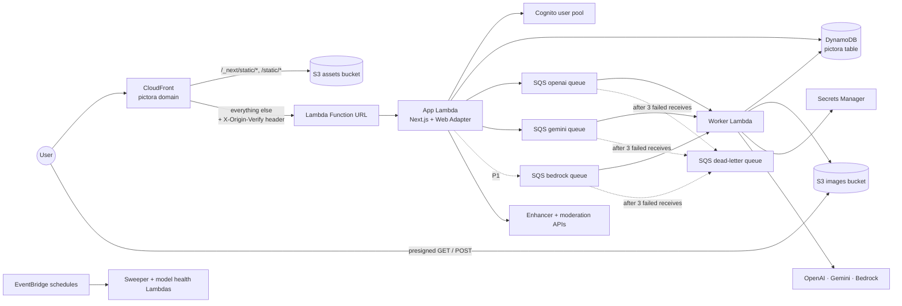
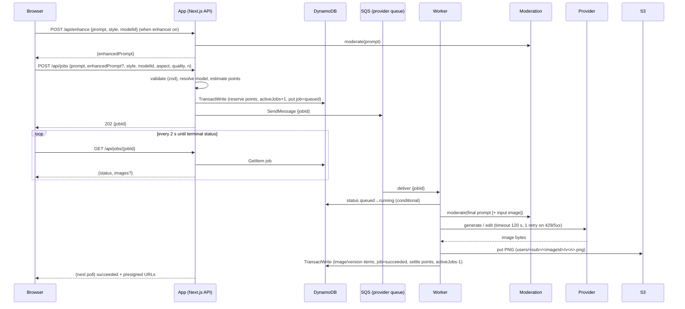
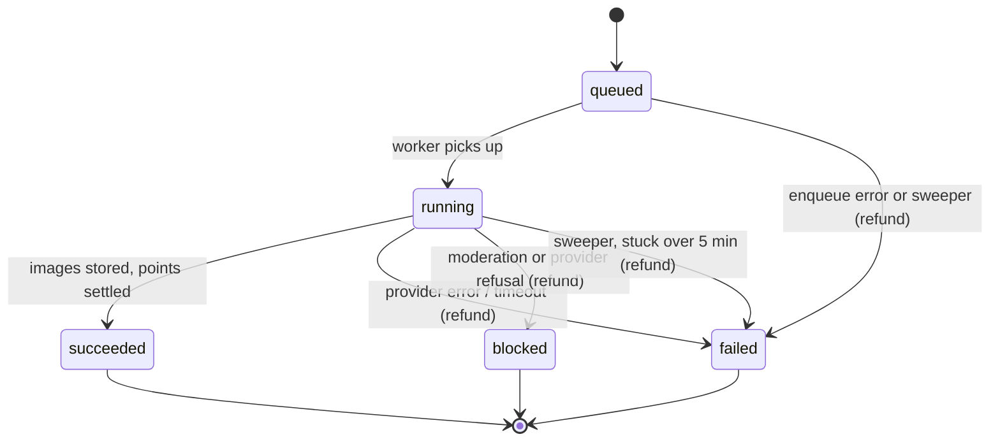

# Pictora Technical Design

Oct 8, 2026 · Rakesh Pillai · Status: Draft v0.1 · Based on the [PRD](prd.md)

This document describes how Pictora is built: components, data model, job pipeline, provider integration, security and testing. CI/CD is covered separately in [cicd_design.md](cicd_design.md). Requirement IDs (GEN-1, ADM-5, …) refer to the PRD.

## 1. Summary of decisions

| Area | Decision |
| --- | --- |
| Region | `us-west-2` for everything; ACM certificate for CloudFront in `us-east-1` |
| Accounts and environments | One AWS account for both environments (accepted; see the risks in the CI/CD design), referenced as a GitHub variable and never committed. Two environments, `dev` and `prod`, as separate CDK stacks |
| CPU architecture | arm64 (Graviton) for all Lambdas: about 20% cheaper; images are built natively on GitHub's free arm64 runners (public repo) |
| Repository | Monorepo with npm workspaces: `app/`, `worker/`, `packages/core`, `packages/providers`, `infra/`, `e2e/` |
| Language and runtime | TypeScript everywhere, Node.js 22 LTS |
| Web app | Next.js (App Router, `output: 'standalone'`) in a container on Lambda with the AWS Lambda Web Adapter, behind CloudFront |
| Background work | SQS queue per provider and a worker Lambda (container image) |
| Data | DynamoDB single table, on demand; S3 for images |
| Auth | Amazon Cognito user pool (Google + email/password), managed login, OAuth code flow with PKCE, httpOnly cookies |
| Secrets and config | Secrets Manager for provider keys; model registry in DynamoDB, seeded from a JSON file in the repo |
| Image delivery | S3 presigned GET URLs (15 min); uploads via S3 presigned POST |
| Infrastructure as code | AWS CDK v2 (TypeScript) |
| Observability | Powertools for AWS Lambda (TypeScript) logs and metrics, CloudWatch dashboard and alarms, AWS Budgets |
| Testing | Vitest (unit), React Testing Library (components), CDK assertions (infra), Playwright (end to end against dev with a mock provider) |

Images use S3 presigned URLs rather than CloudFront signed URLs. They need no CloudFront key pair to manage, and edge caching adds little for private images seen by one user.

## 2. Repository layout

```
pictora/
├── app/                    Next.js web app (UI + API route handlers)
│   ├── src/app/            App Router pages and /api routes
│   ├── src/lib/            auth, db, s3, rate limits, API helpers
│   └── Dockerfile          standalone build + Lambda Web Adapter
├── worker/                 Lambda handlers (container image)
│   ├── src/generate.ts     SQS consumer: moderate → generate/edit → store → settle
│   ├── src/sweeper.ts      scheduled: fail and refund stuck jobs
│   ├── src/model_health.ts scheduled: check registry models still exist
│   └── Dockerfile
├── packages/
│   ├── core/               shared types, zod schemas, registry types, points maths, size mapping
│   │   └── models.json     model registry seed (source of truth for model config)
│   └── providers/          provider adapters (OpenAI, Gemini, Bedrock, Mock), enhancer, moderation
├── infra/                  CDK app (stacks, constructs, tests)
├── e2e/                    Playwright tests
├── docs/                   PRD, tech design, CI/CD design
└── package.json            npm workspaces root
```

Files use `snake_case`, and classes and React components use `PascalCase`.

## 3. Runtime architecture



### 3.1 Web app on Lambda

- **Build:** `next build` with `output: 'standalone'`. The Docker image copies `.next/standalone` and runs `node server.js` on port 3000. The Lambda Web Adapter extension is copied into `/opt/extensions/`.
- **Adapter settings:** `AWS_LWA_PORT=3000`, `AWS_LWA_READINESS_CHECK_PATH=/api/health`, `AWS_LWA_INVOKE_MODE=response_stream`. The Function URL invoke mode is `RESPONSE_STREAM`.
- **Lambda settings:** arm64, 1024 MB, 30 s timeout, reserved concurrency 20 in prod (cost guard).
- **Static assets:** `.next/static` and `public/` are uploaded to an S3 assets bucket by CDK `BucketDeployment`. CloudFront serves them through Origin Access Control with a long cache time. Next.js hashes the file names, so no invalidation is needed.
- **Function URL protection:** the URL uses auth type `NONE`. CloudFront adds a secret `X-Origin-Verify` header, and Next.js middleware rejects requests without it (403). The secret lives in Secrets Manager and is rotated by redeploying.
  Why not Origin Access Control for Lambda: with it, POST bodies need a client-computed `x-amz-content-sha256` header, which browsers don't send.
- **CloudFront:** the default behaviour uses `CachingDisabled` and the `AllViewerExceptHostHeader` origin request policy. A Function URL rejects a forwarded `Host` header.

### 3.2 Worker

- Container image Lambda on arm64 (needed for `sharp`, which has a native binary), 1536 MB, 180 s timeout.
- One SQS queue per provider (`openai`, `gemini`, and `bedrock` in P1), each with its own event source mapping. Batch size 1, `ReportBatchItemFailures`, and `maximumConcurrency` 5 per queue (set in config) to stay inside provider rate limits.
- Visibility timeout 1,080 s (6 × the function timeout, as AWS recommends). `maxReceiveCount` 3, then the dead-letter queue, which has an alarm.
- Scheduled functions, triggered by EventBridge:
  - `sweeper` (every 5 min): marks jobs stuck in `running` for over 5 min as `failed`, refunds points, and frees the concurrency slot.
  - `model_health` (daily): checks every enabled registry model still exists with its provider. A missing model or a deprecation notice triggers an SNS alert, which covers the model-retirement risk in the PRD.

## 4. Data model (DynamoDB)

There is one table, `pictora-<env>`, on demand, with point-in-time recovery on in prod. Keys are `PK` and `SK` (strings), and one global secondary index, `GSI1` (`GSI1PK`, `GSI1SK`). Expiry uses the `ttl` attribute. IDs are ULIDs, so they sort by time.

| Entity | PK | SK | Key attributes | TTL |
| --- | --- | --- | --- | --- |
| User profile | `USER#<sub>` | `PROFILE` | email, createdAt, tosAcceptedAt, birthYearOk, status (`active` \| `suspended`), `dailyPoints` (optional override, ADM-5), activeJobs, cooldownUntil, abuseFlag | — |
| Daily usage | `USER#<sub>` | `USAGE#<yyyy-mm-dd>` | `used` (points reserved + spent), `GSI1PK=USAGE#<date>`, `GSI1SK=<used, zero-padded>` | 35 days |
| Rate window | `USER#<sub>` | `RATE#<yyyymmddHHMM>` | count | 2 min |
| Image | `USER#<sub>` | `IMG#<imageId>` | title, latestVersion, versionCount, style, modelId, createdAt, thumbnail key | — |
| Image version | `USER#<sub>` | `VER#<imageId>#<n>` | s3Key, width, height, parentVersion, prompt, enhancedPrompt, editInstruction, modelId, quality, aspect, seed, jobId, costPoints | — |
| Block record | `USER#<sub>` | `BLOCK#<ulid>` | stage, category | 24 h |
| Job | `JOB#<jobId>` | `META` | userId, type (`generate` \| `edit`), status, request (zod-validated JSON), modelId, provider, pointsReserved, pointsCharged, providerCostCents, error, startedAt, finishedAt, attempts | 30 days |
| Model registry | `MODEL#<modelId>` | `CONFIG` | registry entry (section 6.1) | — |
| Platform spend | `PLATFORM` | `SPEND#<yyyy-mm>` | spentCents, capCents | — |
| Daily stats | `STATS#<yyyy-mm-dd>` | `MODEL#<modelId>` | images, points, providerCostCents, failures, blocks | 400 days |
| Moderation log | `MODLOG#<yyyy-mm-dd>` | `<ulid>` | userId, stage, category, promptExcerpt, provider | 90 days |

**Access patterns**

| Pattern | Operation |
| --- | --- |
| Gallery, newest first (GAL-1) | Query `PK=USER#<sub>`, `SK begins_with IMG#`, descending, with a cursor |
| Image detail + versions (GAL-2) | Query `PK=USER#<sub>`, `SK begins_with VER#<imageId>#` |
| Job status poll | GetItem `JOB#<jobId>`, checking that userId matches the caller |
| Today's usage | GetItem `USAGE#<today>` |
| Top users by spend today (ADM-3) | Query GSI1 `GSI1PK=USAGE#<date>`, descending |
| Blocks in the last 24 h | Query `SK begins_with BLOCK#` (TTL plus a filter on createdAt) |
| Account deletion (AUTH-3) | Query all items under `USER#<sub>` and delete them in batches; delete the S3 prefix `users/<sub>/` |

### 4.1 Points and limits

Points are integers, and 1 point is $0.01 of provider list price.

- **Estimate:** `points = registry.costPoints[quality][sizeTier] × imageCount`.
- **Reserve** (in the create-job API), as one `TransactWriteItems` call:
  1. Update `USAGE#<today>`: `ADD used :p`, on condition `attribute_not_exists(used) OR used <= :limitMinusP`. The limit is `profile.dailyPoints ?? DEFAULT_DAILY_POINTS` (25).
  2. Update `PROFILE`: `ADD activeJobs :1`, on condition `activeJobs < :2` and `status = active` and no cooldown in force (LIM-3).
  3. Put `JOB#<id>` with condition `attribute_not_exists(PK)`.
- **Settle** (worker, on success): if the actual cost is lower than the estimate, `ADD used :negativeDiff`. Then increment `PLATFORM/SPEND#<month>` and `STATS#…` by the actual cost, and decrement `activeJobs`.
- **Refund** (failure or block): `ADD used :-p` and decrement `activeJobs`, in the same transaction that sets the job's final status.
- **Rate limit:** 10 jobs a minute, via `ADD count :1` on `RATE#<minute>` with the condition `count < 10`.
- **Platform cap:** at job creation, read `PLATFORM/SPEND#<month>`. If `spentCents ≥ capCents` ($100), reject any model whose quality tier isn't `draft`. At 80%, an alarm emails the admin. A small overrun from jobs already in flight is accepted.
- The reset at 00:00 UTC comes for free, because the usage key is per day.

## 5. Job pipeline

### 5.1 Generate flow



If `SendMessage` fails after the reservation, the API marks the job `failed` and refunds in the same request.

### 5.2 Job states



**Idempotency:** the worker moves the job `queued → running` with a conditional update. If SQS redelivers a message whose job is already `running` or finished, the worker acknowledges it and does nothing. A job that died mid-flight is failed and refunded by the sweeper, never sent to the provider again. That rules out paying twice for one job.

**Retries:** the worker retries a provider call once, after 2 s with jitter, on HTTP 429, 5xx or a network error. It does not retry on 4xx or a safety refusal (GEN-10).

### 5.3 Edits (EDIT-1 to EDIT-5)

- An edit is a job of type `edit`, with `parentImageId`, `parentVersion` and an `instruction`. It can carry up to 3 `referenceKeys`, uploaded images in S3.
- Edits are **stateless**: each one sends the parent version's PNG plus the instruction to the provider. No provider chat history is kept, so edits are reproducible, provider-independent, and survive model changes.
- The result is stored as version `n+1` of the same image. Earlier versions are never overwritten (EDIT-3).
- **Uploads (EDIT-2):** the browser asks `POST /api/uploads` for a presigned POST. Its conditions are `content-length-range` up to 10 MB and a content type of JPEG, PNG or WebP. The browser uploads straight to `uploads/<sub>/<ulid>`. The worker moderates the image before using it, then stores it as version 1 of a new image. Uploads that are never used expire after 1 day (lifecycle rule).

## 6. Model registry and provider adapters

### 6.1 Registry entry

```ts
// packages/core/src/registry.ts
export type Quality = 'draft' | 'standard' | 'high';
export type Aspect = '1:1' | '4:5' | '3:2' | '2:3' | '16:9' | '9:16';

export interface ModelConfig {
  id: string;                      // stable Pictora id, e.g. "gemini-flash"
  provider: 'openai' | 'gemini' | 'bedrock' | 'mock';
  providerModelId: string;         // e.g. "gemini-3.1-flash-image"
  displayName: string;
  strengths: string[];
  enabled: boolean;                // kill switch (ADM-2)
  environments: ('dev' | 'prod')[];// "mock" is dev-only
  capabilities: {
    generate: boolean;
    edit: boolean;
    transparentBackground: boolean;
    negativePrompt: boolean;
    seed: boolean;
    referenceImages: number;       // max references accepted
    aspects: Aspect[];
  };
  qualities: Partial<Record<Quality, { providerParams: Record<string, unknown>; costPoints: number }>>;
  defaultFor: string[];            // style preset ids
  eolDate?: string;                // ISO date, alert 60 days before (PRD risk table)
}
```

- `packages/core/models.json` is the source of truth. A CDK custom resource writes it to DynamoDB on every deploy, with an upsert that **keeps** the `enabled` field already in DynamoDB, so a kill switch flipped by hand survives deploys.
- The app and the worker cache the registry in memory for 60 s, so a kill switch takes effect within 1 minute (ADM-2).
- The UI gets models only from `GET /api/models`, filtered by `enabled` and environment.

### 6.2 Adapter interface

```ts
// packages/providers/src/types.ts
export interface ImageRequest {
  prompt: string;                  // final prompt (enhanced or raw)
  negativePrompt?: string;
  aspect: Aspect;
  quality: Quality;
  count: number;                   // 1–4
  seed?: number;
  transparentBackground?: boolean;
  inputImage?: Uint8Array;         // edits
  referenceImages?: Uint8Array[];
  signal: AbortSignal;             // 120 s timeout
}

export interface ImageResult {
  images: { png: Uint8Array; width: number; height: number; seed?: number }[];
  providerRequestId?: string;
  providerCostCents: number;       // computed from the provider's usage data when available
}

export interface ImageProvider {
  generate(model: ModelConfig, req: ImageRequest): Promise<ImageResult>;
  edit(model: ModelConfig, req: ImageRequest): Promise<ImageResult>;
}
```

Adapters throw typed errors (`ProviderSafetyError`, `ProviderRateLimitError`, `ProviderTimeoutError`, `ProviderError`), which the worker maps to job states. Every adapter returns PNG: if a provider sends another format, `sharp` converts it losslessly to PNG and leaves provenance metadata in place.

| Adapter | SDK | Generate | Edit | Notes |
| --- | --- | --- | --- | --- |
| OpenAI | `openai` | `images.generate` with `output_format: 'png'`, `quality`, `size`, `background` | `images.edit` with the parent image (+ references) | Sizes: 1024×1024, 1536×1024, 1024×1536; other aspects are generated at the nearest size and centre-cropped |
| Gemini | `@google/genai` | `models.generateContent` with an image response and an aspect-ratio config | Same call, with the parent image as inline data + the instruction | The same SDK works with the Gemini API (API key) or Vertex AI (`vertexai: true`), so the open Vertex question changes only config |
| Bedrock (P1) | `@aws-sdk/client-bedrock-runtime` | `InvokeModel` with Stability request bodies | Stability edit models through `us.` inference profiles | IAM role auth; no key |
| Mock (dev/test) | none | Returns a generated placeholder PNG after a configurable delay, or an error when the prompt contains a test keyword | Same | Lets CI and end-to-end tests run with no provider spend |

### 6.3 Prompt enhancer and moderation

- **Enhancer (ENH-1 to ENH-4):** `POST /api/enhance` is synchronous, with a target of under 3 s. A system prompt tells the LLM to add subject, composition, lighting and style detail suited to the model, to keep the user's intent, and to add no people, brands or new content. The output is capped at 1,500 characters. The model is chosen in config (`ENHANCER_MODEL`), so the GPT-5.6 Luna versus Gemini Flash test in M2 needs only a config change. Enhancer calls are not charged to users but are counted in the stats.
- **Moderation:** the OpenAI moderation endpoint (`omni-moderation-latest`) checks text and images. It runs on the raw prompt in `/api/enhance`, and in the worker on the final prompt and any input image. A flag means the job is `blocked`, with a `BLOCK#` record and a `MODLOG#` entry. Three blocks in 24 hours set `cooldownUntil` to now + 24 h. A provider safety refusal is handled the same way.

## 7. API surface

All routes are Next.js route handlers under `/api`. They need a valid session unless marked public, and they validate input with zod schemas from `packages/core`.

| Method | Path | Purpose | Notes |
| --- | --- | --- | --- |
| GET | `/api/health` | Readiness and smoke test | Public; no downstream calls |
| GET | `/api/models` | Enabled models, styles, costs | Cached 60 s |
| GET | `/api/me` | Profile, points left today, limits | |
| POST | `/api/me/onboarding` | Accept terms, confirm age 13+ (AUTH-4) | Needed before the first job |
| DELETE | `/api/me` | Delete the account (AUTH-3) | Disables the Cognito user; async purge |
| POST | `/api/enhance` | Rewrite a prompt | Moderated; rate-limited |
| POST | `/api/jobs` | Create a generate or edit job | 202 + jobId; 402 when out of points, 429 when rate-limited, 403 when blocked or cooled down |
| GET | `/api/jobs/:id` | Job status and results | Owner only |
| POST | `/api/uploads` | Presigned POST for an upload | 10 MB, JPEG/PNG/WebP |
| GET | `/api/images` | Gallery page (cursor) | Thumbnails as presigned URLs |
| GET | `/api/images/:id` | Image detail + versions | |
| DELETE | `/api/images/:id` | Delete an image and all its versions | |
| GET | `/api/images/:id/versions/:n/download` | Redirect to a presigned original PNG | `Content-Disposition: attachment` |
| POST | `/api/reports` | Report an output | Writes a `MODLOG` entry |
| GET | `/api/admin/stats` | Spend and blocks dashboard (ADM-3) | `admins` Cognito group only |
| POST | `/api/admin/users/:sub/suspend` | Suspend a user (ADM-4) | Admins only |

Admin model switches (ADM-2) and per-user point overrides (ADM-5) are edited in DynamoDB through the console or CLI in v1, as the PRD says.

## 8. Authentication

- **Cognito user pool:** email as the username, verified email required, and Google as a federated identity provider. An `admins` group. Managed login (hosted UI) on a Cognito domain.
- **Flow:** `/auth/login` → Cognito authorize (code + PKCE) → `/auth/callback` exchanges the code on the server → tokens go into `httpOnly`, `Secure`, `SameSite=Lax` cookies (access token 1 h, refresh token 30 days). `/auth/logout` clears the cookies and calls Cognito logout.
- **Verification:** Next.js middleware checks the access token with `aws-jwt-verify` (JWKS cached) on `/api/*` and protected pages. An expired access token is refreshed on the server with the refresh token.
- **First login:** a profile is created on first API call; the onboarding page collects terms acceptance and age confirmation (AUTH-4).
- **Abuse signals:** a Cognito pre-sign-up Lambda checks the email domain against a disposable-domain list. A match sets `abuseFlag`, which lowers `dailyPoints` to 5.
- **CSRF:** state-changing routes require the `Origin` header to match the site domain, on top of the SameSite cookies.

## 9. Storage (S3)

| Bucket | Contents | Settings |
| --- | --- | --- |
| `pictora-<env>-images` | `users/<sub>/<imageId>/v<n>.png`, `users/<sub>/<imageId>/v<n>_thumb.webp`, `uploads/<sub>/<ulid>` | Block public access, SSE-S3, CORS for presigned POST from the site domain, versioning on in prod, lifecycle: `uploads/` expires after 1 day, old object versions after 30 days |
| `pictora-<env>-assets` | Next.js static files | Block public access; read only through CloudFront Origin Access Control |

- Thumbnails (512 px WebP) are made by the worker with `sharp`, for fast gallery loads. Downloads always serve the original PNG (GEN-7).
- Presigned GET URLs last 15 minutes.

## 10. Configuration and secrets

| Item | Where | Notes |
| --- | --- | --- |
| OpenAI API key | Secrets Manager `pictora/<env>/openai` | Set by hand once per environment |
| Gemini API key or Vertex service account | Secrets Manager `pictora/<env>/gemini` | Format depends on the Vertex decision |
| Origin verify header | Secrets Manager `pictora/<env>/origin-verify` | Generated by CDK |
| Default daily points (25), platform cap ($100), queue concurrency, enhancer model | CDK context per environment → Lambda environment variables | Changing them is a deploy, not code |
| Model registry | `packages/core/models.json` → DynamoDB | Kill switches edited in DynamoDB |

Secrets are read once per Lambda cold start and cached for 5 minutes.

## 11. Observability

- **Logs:** Powertools Logger, as JSON, with `jobId`, `userSub` (hashed), `modelId`, `provider`, `latencyMs`, `costCents` and `outcome`. Retention: 30 days in dev, 90 days in prod.
- **Metrics:** Powertools Metrics (EMF), under namespace `Pictora/<env>`: `JobsCreated`, `JobsSucceeded`, `JobsFailed`, `JobsBlocked`, `ProviderLatencyMs` (per provider), `ProviderCostCents`, `PointsReserved`, `EnhancerLatencyMs`.
- **Dashboard:** jobs by status, p50 and p95 latency per provider, error rate, queue depth and age, dead-letter queue depth, spend for today and this month.
- **Alarms** (sent to SNS, then email): failure rate above 5% over 15 min, p95 latency above 60 s, dead-letter queue above 0, oldest queue message older than 5 min, app 5xx above 1%, monthly spend at 80% of the cap, and model health failures.
- **Budgets:** AWS Budgets alerts at 50%, 80% and 100% of the monthly budget. Set OpenAI and Google billing alerts at the same levels by hand.

## 12. Security

- Least-privilege IAM per function. The app can read and write the table, send to the queues, and presign for its bucket. The worker can also read the secrets and call Bedrock. Neither can delete the table or the buckets.
- No secrets in the browser or in the repo. Provider calls happen only in the worker or the app's server side.
- Every API checks ownership: users can reach only their own items under `USER#<sub>`, and job reads check `userId`.
- Security headers via Next.js middleware: CSP, HSTS, `X-Content-Type-Options`, `Referrer-Policy`, and `frame-ancestors 'none'`.
- Input limits: prompt up to 2,000 characters, avoid field up to 500, `n` from 1 to 4, and enum checks on every option.
- AWS WAF is **not** in v1 (it costs about $5–10 a month, against a $100 total cap). App-level rate limits and points cover abuse at launch. Add WAF with a rate-based rule if abuse appears.

## 13. Testing strategy

| Layer | Tool | Scope | Runs in |
| --- | --- | --- | --- |
| Core logic | Vitest | Points maths, size and aspect mapping, zod schemas, registry validation (`models.json` must parse and have no duplicate IDs) | CI on every push |
| Provider adapters | Vitest + `msw` | Request shape per model and quality, response parsing, error mapping, PNG conversion; recorded fixtures, no live calls | CI |
| API routes | Vitest + DynamoDB Local (Docker service) | Reserve, settle and refund transactions, limits, ownership checks | CI |
| Worker | Vitest + DynamoDB Local + mock provider | Full job lifecycle, idempotency on redelivery, sweeper | CI |
| UI components | Vitest + React Testing Library | Prompt form, model picker, points display, gallery, edit panel | CI |
| Infra | CDK assertions | Resource settings (encryption, public access blocks, alarms, IAM scope) and snapshot | CI |
| End to end | Playwright | Sign in (Cognito test user), generate with the mock provider, edit, gallery, delete | After each dev deploy |
| Live provider check | Script | One draft image per enabled model | Manual before a prod release |

## 14. Environments

| | dev | prod |
| --- | --- | --- |
| Stacks | `PictoraDev-*` | `PictoraProd-*` |
| Domain | `pictora.rpillai.dev` (Route 53 zone `rpillai.dev`, ACM DNS validation) | Open question |
| Models | All, plus `mock` | Real models only |
| Daily points | 1,000 (for testing) | 25 |
| Spend cap | $20/month | $100/month |
| DynamoDB PITR / S3 versioning | Off | On |
| Removal policy | Destroy | Retain |
| Cognito | Separate pool | Separate pool |

**CDK stacks per environment**

| Stack | Region | Resources |
| --- | --- | --- |
| `Certificate` | us-east-1 | ACM certificate for CloudFront (cross-region reference) |
| `Data` | us-west-2 | DynamoDB table, images bucket, registry seed custom resource |
| `Auth` | us-west-2 | Cognito user pool, Google IdP, app client, pre-sign-up Lambda |
| `Jobs` | us-west-2 | SQS queues + dead-letter queue, worker Lambda, sweeper, model health, secrets |
| `Web` | us-west-2 | App Lambda + Function URL, assets bucket, CloudFront, DNS record |
| `Monitoring` | us-west-2 | Dashboard, alarms, SNS topic, budget |

## 15. Rough monthly infrastructure cost (excluding provider spend)

These are estimates for launch traffic (under 1,000 users a month) and should be checked against AWS pricing.

| Service | Estimate |
| --- | --- |
| Lambda (app + worker) | Under $2 (mostly free tier) |
| DynamoDB on demand | Under $1 |
| S3 + requests | Under $1 at about 10 GB |
| CloudFront | Under $1 (free tier: 1 TB) |
| SQS, EventBridge | Under $0.10 |
| Cognito | $0 under the free tier's monthly active user limit |
| Secrets Manager | About $1.20 a month per environment (3 secrets at $0.40) |
| CloudWatch logs, metrics, alarms | $3–5 |
| ECR | Under $0.50 |
| **Total** | **About $5–12 a month per environment** |

## 16. Open questions

- [x] Dev domain: `pictora.rpillai.dev`.
- [ ] Prod domain.
- [ ] Gemini API or Vertex AI. This decides the secret format and billing; the adapter handles both.
- [ ] Which enhancer model wins (decided in M2 by test).
